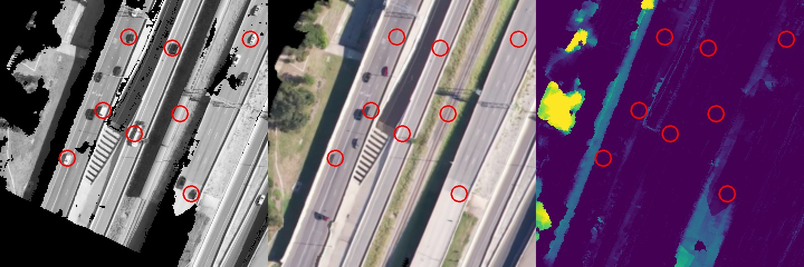

# Validation, 2026-09-28: footage, time, accuracy, and what breaks it

Every number below comes from a run of the current code on this Mac (Apple M5, 16 GB, GPU via Metal),
scored by scripts that read only the run's own output folder. Nothing was tuned on the scoring data
except where a row says so. Pipeline code frozen at commit `be58a3d` plus the working-tree changes to
`pipeline/stages.py` (RTK reader, OpenCV 5 compatibility) before the first flight02 run.

## Data and references

| Footage | What it is | Ground truth used |
|---|---|---|
| DJI_1001 (Austin, USA) | DJI, camera straight down, ~280 m, 1080p 60 fps, 11.4 min; GPS in a DJI CSV | none published |
| PinPoint flight01 (Spain) | fixed-wing VTOL, single-frequency GPS (no RTK), 720p 60 fps; 6-min clip, grid at 100-127 m over farmland | 64 nadir survey features, IGN PNOA orthophoto, IGN MDT05 LiDAR terrain model |
| PinPoint flight02 (Spain) | same aircraft, river and hill with 30 m relief, 66-97 m above ground; 10-min clip | 53 nadir survey features, IGN PNOA, IGN MDT05 |

PinPoint dataset: [doi:10.5281/zenodo.22671839](https://doi.org/10.5281/zenodo.22671839) (CC BY 4.0).
References fetched from IGN's public services for each flight's area: the PNOA orthophoto (WMS, 0.3 m)
and the MDT05 terrain model (WCS, 5 m grid from airborne LiDAR).

The PinPoint camera's calibration is an optional input the problem statement allows: focal from the
dataset (72.3 deg horizontal field of view) and lens distortion k1 -0.241, k2 0.050 (measured once on
flight01, matching COLMAP's self-calibration), passed as `--hfov 72.3 --dist=-0.241,0.050,0,0`.
Matching is SIFT for this 720p camera (see Findings). Clip timing: each clip's first frame was found in
the original video by frame matching, then telemetry offset = that time + the dataset's sync (1.2 s / 49.4 s).

**Datum.** GPS positions are in ITRF (WGS84) at the flight date; Spain's maps are in ETRS89, fixed to
the European plate. At flight01 on 2026-07-05 that difference is E +0.69 m, N +0.69 m (PROJ, ETRF2000 to
ITRF2014). Horizontal results are given raw and datum-converted.

## Footage, time and accuracy

| Footage | Video | Mode | Time (Mac) | Outcome | Accuracy achieved | Checked against |
|---|---|---|---|---|---|---|
| DJI_1001, first 2 min | 2.0 min 1080p | Measured 3D | 1.3 min (76 s) | valid | 1.18 M vertices, 93.8 % measured | no ground truth |
| DJI_1001, first 5 min | 5.0 min 1080p | Measured 3D | 2.9 min (173 s) | valid | 3.26 M vertices, 92.8 % measured | no ground truth |
| DJI_1001, first 10 min | 10.0 min 1080p | Measured 3D | 6.0 min (359 s) | valid | 7.30 M vertices, 87.8 % measured | no ground truth |
| DJI_1001, full flight | 11.4 min 1080p | Measured 3D | 6.3 min (381 s) | valid | 7.99 M vertices, 84.2 % measured | no ground truth |
| PinPoint flight01 | 6.0 min 720p | Measured 3D | 6.1 min | valid | orthomosaic within **0.92 m** of IGN (median of 6 60 m tiles, 1.89 m before datum conversion); distances 0.83 m (0.38 %); heights 0.23 m vs LiDAR | IGN PNOA + MDT05 |
| PinPoint flight01 | 6.0 min 720p | Terrain 2.5D | 4.5 min | valid | whole block within 0.30 m of IGN on average (43 tiles), but 3.26 m per tile (strip distortion 3.40 m); measured heights 0.98 m from LiDAR | IGN PNOA + MDT05 |
| PinPoint flight02 (hold-out) | 10.0 min 720p | Measured 3D | stopped after 5.5 min | **rejected** | camera solve could not pose about a third of the cameras; no model was output | – |

## Scalability: one flight cut to different lengths (DJI_1001, same Mac)

| Video | Keyframes | Time | Seconds per video minute | Peak memory | Target (15 min per 10 min) |
|---|---|---|---|---|---|
| 2.0 min | 8 | 1.3 min | 38 s | 2.2 GB | 3.0 min |
| 5.0 min | 22 | 2.9 min | 35 s | 3.2 GB | 7.5 min |
| 10.0 min | 45 | 6.0 min | 36 s | 4.7 GB | 15.0 min |
| 11.4 min | 52 | 6.3 min | 33 s | 5.1 GB | 17.1 min |

Time grows linearly with video length (about 36 s per minute of 1080p video) and memory
sub-linearly; every length finishes in well under the problem statement's budget.

## flight01 in detail: settings and what each one changes

Columns: orthomosaic vs IGN per 60 m tile, raw / datum-converted (tiles); tile-to-tile internal
distortion; surveyed features located in both orthophotos (n); survey rays cast from the video frame
onto the model (points hit); distances between tiles >= 100 m apart, error / relative; height bias
against the IGN MDT05 LiDAR terrain model on ground cells.

| Run | Time | Tiles vs IGN (n) | Internal distortion | Features vs IGN (n) | Survey rays (n) | Distances | Height bias |
|---|---|---|---|---|---|---|---|
| **Measured 3D, calibrated, SIFT (reported)** | 6.1 min | 1.89 m / 0.92 m (6) | 0.75 m | 1.48 m (13) | 3.58 m (19) | 0.83 m / 0.38 % | 0.23 m |
| **Terrain 2.5D, calibrated, SIFT (reported)** | 4.5 min | 3.26 m / 3.26 m (43) | 3.40 m | 1.82 m (25) | 4.95 m (60) | 4.01 m / 1.47 % | -1.66 m |
| Measured 3D + optional IGN alignment | 6.5 min | 2.36 m / 2.42 m (5) | 1.04 m | 4.21 m (13) | 4.19 m (19) | 0.83 m / 0.50 % | -1.00 m |
| Measured 3D, gravity check off | 6.2 min | 2.82 m / 2.08 m (4) | 1.17 m | 2.75 m (12) | 3.97 m (18) | 1.08 m / 0.24 % | 0.37 m |
| Measured 3D, calibrated, DISK+LightGlue (default matcher) | 5.8 min | – / – (0) | – | 15.26 m (6) | 10.84 m (9) | – / – | 1.98 m |
| Terrain 2.5D, calibrated, DISK+LightGlue | 4.0 min | 8.84 m / 8.82 m (29) | 6.81 m | 8.06 m (13) | 8.96 m (61) | 7.63 m / 2.76 % | -1.79 m |
| Measured 3D, no calibration (auto focal) | 7.0 min | 13.92 m / 14.44 m (1) | 0.00 m | 5.45 m (9) | 8.63 m (9) | – / – | 14.61 m |
| Terrain 2.5D, no calibration (auto focal) | 5.3 min | 8.54 m / 8.60 m (32) | 7.66 m | 6.49 m (8) | 7.53 m (61) | 6.39 m / 2.29 % | 14.09 m |

Logged GPS and attitude projected onto terrain, PinPoint's own baseline on the same points: 9.87 m median.

## flight02: the hold-out flight

flight02 was never processed before the code was frozen. It was run three times: the defaults with
the camera calibration; the settings chosen on flight01 (calibration + SIFT); and those with the
gravity check off, since this mount logs only its pitch setpoint and has no roll axis (dataset
README). All three stopped in the camera solve:

- defaults + calibration: bundle adjustment rejected: 140/385 cameras could not be posed from the images.
- calibration + SIFT: bundle adjustment rejected: 130/385 cameras could not be posed from the images.
- calibration + SIFT, gravity check off: Camera solution rejected before dense geometry: max_rotation_change_deg=93.114 exceeds 30.

At 66-97 m above a river valley the ground moves through the frame faster than on flight01, so a
third of the keyframes overlap too little with their neighbours to be posed from the images. The
pipeline refuses to build a model in that state instead of producing a wrong one. Closing this gap
(denser keyframes and a wider matching window at low altitude) is the next piece of work.

## Baseline: COLMAP on exactly the same keyframes

COLMAP 4.2 on this Mac (CPU only: no CUDA, so no dense stereo), the same 193 keyframes at full
resolution, exhaustive matching, self-calibrated OPENCV camera, fitted to the same GPS. Both scored by
the same survey-ray script with the same camera-to-GPS fit, on the survey points both surfaces hit.

| | DRISHTI-3D | COLMAP 4.2 |
|---|---|---|
| Time, same machine, nothing else running | **6.1 min** for the dense, textured, georeferenced model | 21.5 min for a sparse model (features 1.2, matching 16.9, mapping 3.3 min) |
| Cameras posed | 193 of 193 | 193 of 193 |
| Survey rays, the 19 points the Measured 3D surface covers | **3.63 m** | 3.88 m |
| Survey rays, the 60 points the Terrain 2.5D surface covers | **5.65 m** | 6.12 m |
| Lens it solved | supplied: f 876 px, k1 -0.241, k2 0.050 | self-calibrated: f 877 px, k1 -0.242, k2 0.051 |
| Output | 3D mesh, true orthophoto, DSM/DTM, LAS, GeoTIFF, OBJ/GLB | 124,524 sparse points |

The survey-ray numbers are large for both because the ray starts from a camera interpolated to the
survey frame and the survey features were marked on the national orthophoto; they compare the two
pipelines fairly, not either against the truth.

## Ablation: what each part of the pipeline is worth (flight01, same inputs)

Each row changes one thing against the calibrated SIFT runs above.

| Change | Mode | Time | Block offset | Tiles vs IGN (n) | Internal distortion | Survey rays (n) | Height bias / spread |
|---|---|---|---|---|---|---|---|
| none (reference) | Terrain 2.5D | 4.5 min | 0.30 m | 3.26 m (43) | 3.40 m | 4.95 m (60) | -1.66 m / 1.82 m |
| DISK+LightGlue instead of SIFT | Terrain 2.5D | 4.0 min | 5.53 m | 8.84 m (29) | 6.81 m | 8.96 m (61) | -1.79 m / 7.58 m |
| generic scipy solver instead of our Schur solver | Terrain 2.5D | 5.8 min | 0.75 m | 2.48 m (38) | 2.31 m | 4.93 m (61) | -1.42 m / 1.73 m |
| weak GPS prior (20 m instead of 2.5 m) | Terrain 2.5D | 5.5 min | 1.98 m | 3.86 m (33) | 3.15 m | 6.97 m (61) | -1.68 m / 4.60 m |
| no blur / turn gates in keyframe selection | Terrain 2.5D | 6.0 min | 3.81 m | 3.77 m (34) | 2.92 m | 5.23 m (60) | -1.49 m / 5.31 m |
| no camera calibration (auto focal) | Terrain 2.5D | 5.3 min | 2.67 m | 8.54 m (32) | 7.66 m | 7.53 m (61) | 14.09 m / 5.66 m |
| none (reference) | Measured 3D | 6.1 min | 0.34 m | 1.89 m (6) | 0.75 m | 3.58 m (19) | 0.23 m / 3.21 m |
| no cross-view depth check | Measured 3D | 11.8 min | 0.72 m | 2.65 m (23) | 2.03 m | 4.69 m (51) | -1.80 m / 1.02 m |
| no gravity check on image pairs | Measured 3D | 6.2 min | 2.09 m | 2.82 m (4) | 1.17 m | 3.97 m (18) | 0.37 m / 3.79 m |

Block offset: the whole model's shift from the national map (median over tiles, datum-converted).
The two solvers were timed alone: our Schur-complement solver finishes the camera solve in 144 s,
the generic scipy solver in 232 s, with similar accuracy on this flight. Later rows ran two at a time,
so their times are not comparable. The pipeline is deterministic (running the reference again gave
identical numbers), but small input changes that alter the keyframe set move Terrain 2.5D's tile
error on flight01 between about 1.9 and 3.8 m, so only larger differences mean something: the
matcher, the camera calibration, the keyframe gates, and the cross-view depth check.

## Robustness: degraded inputs (flight01, Terrain 2.5D, calibrated, SIFT)

| Input | Outcome | Block offset | Tiles vs IGN (n) | Internal distortion | Survey rays (n) | Height bias / spread |
|---|---|---|---|---|---|---|
| original | valid | 0.30 m | 3.26 m (43) | 3.40 m | 4.95 m (60) | -1.66 m / 1.82 m |
| GPS error 1 m per axis (1.5 m RMS, drifting) | valid | 0.96 m | 1.94 m (36) | 1.10 m | 5.78 m (60) | 0.89 m / 2.33 m |
| GPS error 3 m per axis (4.6 m RMS) | valid | 5.14 m | 6.35 m (37) | 3.40 m | 6.72 m (58) | 3.24 m / 6.06 m |
| GPS error 5 m per axis (7.7 m RMS) | valid | 5.28 m | 9.36 m (43) | 8.40 m | 9.23 m (61) | 5.70 m / 6.58 m |
| half the GPS fixes dropped + a 20 s gap | valid | 2.35 m | 3.84 m (34) | 1.73 m | 4.43 m (60) | -0.54 m / 3.94 m |
| whole video blurred (Gaussian, 2 px) | valid | 0.53 m | 1.91 m (37) | 1.13 m | 3.55 m (60) | -0.50 m / 1.36 m |
| video recompressed to 0.6 Mbit/s | valid | 0.57 m | 2.17 m (33) | 1.63 m | 6.67 m (59) | 0.22 m / 2.23 m |
| original, run again (identical: deterministic) | valid | 0.30 m | 3.26 m (43) | 3.40 m | 4.95 m (60) | -1.66 m / 1.82 m |

## Does the confidence tier mean something?

Height error against the IGN LiDAR terrain model on bare-ground 5 m cells, split by the tier the model
gave each cell (after removing the run's overall height offset):

| Run | Measured | Low confidence | Inferred |
|---|---|---|---|
| flight01, Terrain 2.5D (reported) | 0.98 m (2329 cells) | 4.45 m (272 cells) | 3.24 m (784 cells) |
| flight01, Terrain 2.5D, auto focal | 2.51 m (199 cells) | 3.94 m (286 cells) | 4.13 m (1232 cells) |
| flight01, Terrain 2.5D, DISK | 4.84 m (203 cells) | 6.12 m (256 cells) | 4.96 m (925 cells) |

Cells the model calls MEASURED are consistently the closest to the LiDAR truth. LOW and INFERRED are
both clearly worse, but their order against each other is not stable yet.

## Moving vehicles (DJI_1001 highway)

Each keyframe's video frame was warped onto the model's 0.5 m ground grid and compared with the
model's multi-view orthomosaic. Vehicle-sized blobs present in the frame but not in the model are
moving traffic; at each one the model's surface was checked for a bump over 1 m.

| Run | Keyframes registered | Moving-vehicle detections | Left in the model as a >1 m bump |
|---|---|---|---|
| dji_2min | 8 of 8 | 15 | 0 (0.0 %) |
| dji_5min | 11 of 22 | 53 | 0 (0.0 %) |
| dji5_nocons (same detections) | | | 8 (15.1 %) |

The full 11.4-min flight is not in this table: most of its warped views are tree canopy and did not pass
the registration check (correlation >= 0.85 with the orthomosaic), so they were not used.

## Failure cases on purpose

| Input | What the pipeline did | Right call? |
|---|---|---|
| flight02, never seen (low, over a valley) | stopped in the camera solve: a third of the cameras could not be posed; no model written | yes |
| DJI_1001 2-min cut with no telemetry | outcome *unverified*: no keyframes could be spaced without GPS, no geometry, reasons listed on the card | yes, though the card should name the missing GPS first |
| flight01 without the camera calibration | valid, heights 14 m off; the card now says: *focal length not measured: image flow gave 890 px but its pair-to-pair spread (21%) was too large to trust, so the 711 px field-of-view guess was kept...* | yes, since this session's fix |
| DJI_1001 2-min cut, every frame blurred 8 px | valid, surface 13 m lower than the sharp run: the focal cannot be measured from this log, and the blurred images let the solver drift it | now warned (focal not measured); heights on DJI_1001 depend on a calibration the log does not carry |

## Found during this validation

- **Report card now warns when the focal length could not be measured.** Without the calibration,
  flight01's image-flow focal estimate was rejected by its own spread check, the 711 px guess was kept
  (true: 877 px) and heights came out 14 m high while the run still said Valid. The card now carries a
  WARNING telling the operator to supply the calibration, and so does every run whose focal could not
  be measured at all (DJI_1001: the log has no height above ground). A deliberately blurred DJI run shows
  why: same guess, heights 13 m lower than the sharp run.
- **`matching.gravity_check_deg: null` now switches the check off**, as the config documents; before, a
  null fell back to 3 degrees.
- **DISK + LightGlue on 720p video**: it detects on a half-size image (640 x 360 here) with 1,024
  keypoints, and flight01's orthomosaic came out 8.8 m from the map against 1.9-3.3 m with SIFT.
  Settings now offers SIFT for 720p and lower; DISK stays the default for 1080p and 4K.
- **Optional map alignment**: on flight01 it shifted the model 3.3 m the wrong way. Not used for any
  number above; it needs a fix before it is recommended.
- **Low, slow-overlap flights**: flight02 (66-97 m over a valley) leaves a third of the keyframes
  under-observed with the 3-frame matching window. Next: denser keyframes / a wider window at low altitude.
